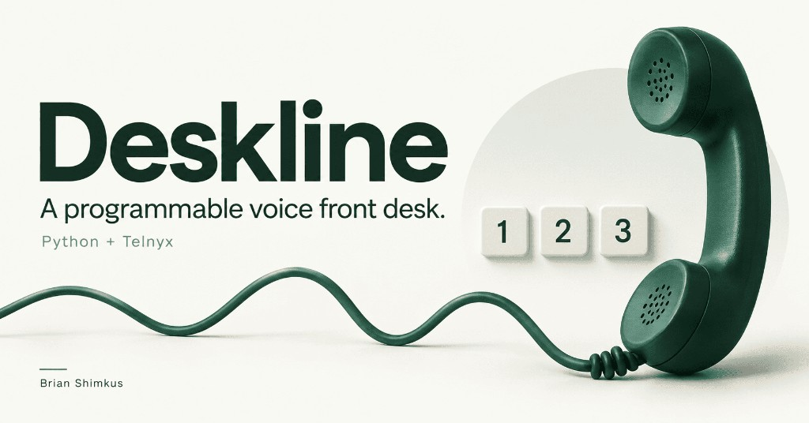

# Deskline

One inbound line. One keypad menu. Three approved answers.

## The customer problem

Brightside Device Repair is a small shop. After hours, callers hit voicemail. They usually want the same three facts: when the shop is open, what the diagnostic fee is, and which devices the shop will look at. Staff return to unclear callbacks and repeat those answers by hand.

Deskline is a **portfolio prototype** of a narrower loop:

**Call → Identify the shop → Keypad menu → Approved answer → Log**

The first version is a programmable-voice menu, not a conversation. Telnyx handles the phone line, speech, and keypad tones. The Python app decides what happens next.

## What it does

- Answers an inbound Telnyx number as fictional Brightside Device Repair
- Speaks a short keypad menu and collects one digit at a time
- Press **1** for hours, **2** for the $35 diagnostic fee, **3** for supported services, **0** to hang up
- Offers one retry on a wrong key or silence, then ends the call politely
- Verifies Telnyx webhook signatures before any call event is trusted
- Keeps a readable event log of the incoming call, selected answer, recovery, and hangup
- Leaves caller phone numbers and credentials out of that log

## What this version is not

This MVP does not recognize speech, generate answers, search documents, open tickets, take payment, or transfer to staff. The three answers are human-authored facts. That is a lookup table, not RAG.

## After the MVP

The longer-term job is to turn unanswered calls into informed callers and requests staff can act on. Each increment should wait on a named user, a repeated pain point, and a measurable outcome — not a longer feature list.

- **Visibility.** A small call-history view and editable business facts, so staff can explain a call and update hours without touching controller code.
- **Conversation.** Speech in and spoken replies for the same approved facts, with a clear fallback when the question is unsupported.
- **Intake.** Capture device, issue, and callback details; read them back; save one confirmed request.
- **Retrieval and integration.** Retrieve from maintained business documents only when a lookup table is no longer enough. Connect confirmed requests to a staff system separately; CRM does not require RAG.
- **Pilot.** Stable hosting, staff access, monitoring, retention, and a tested escalation path before claiming business value.
